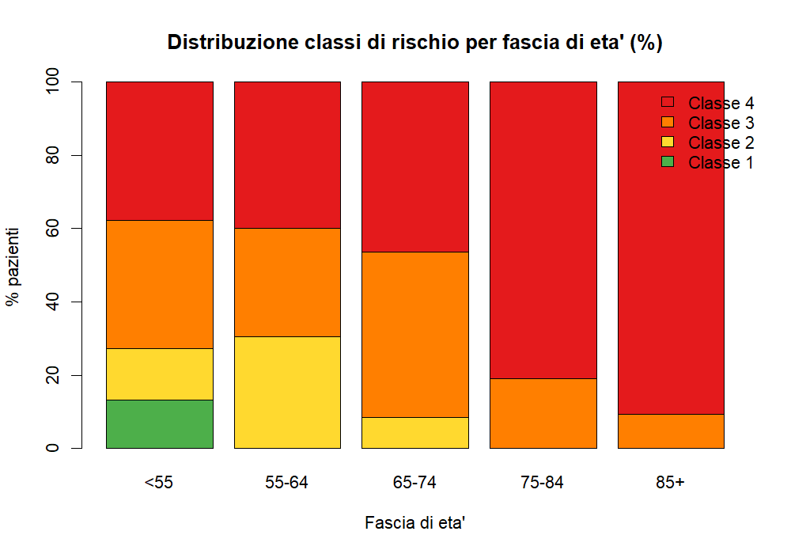
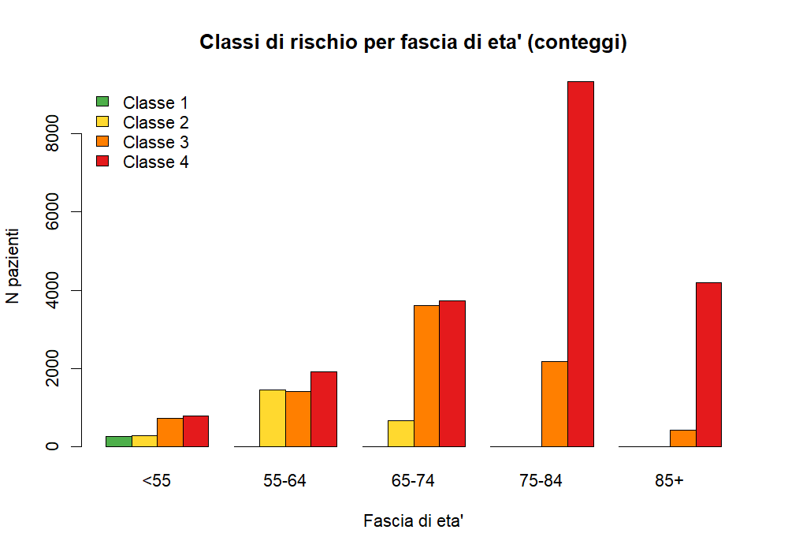
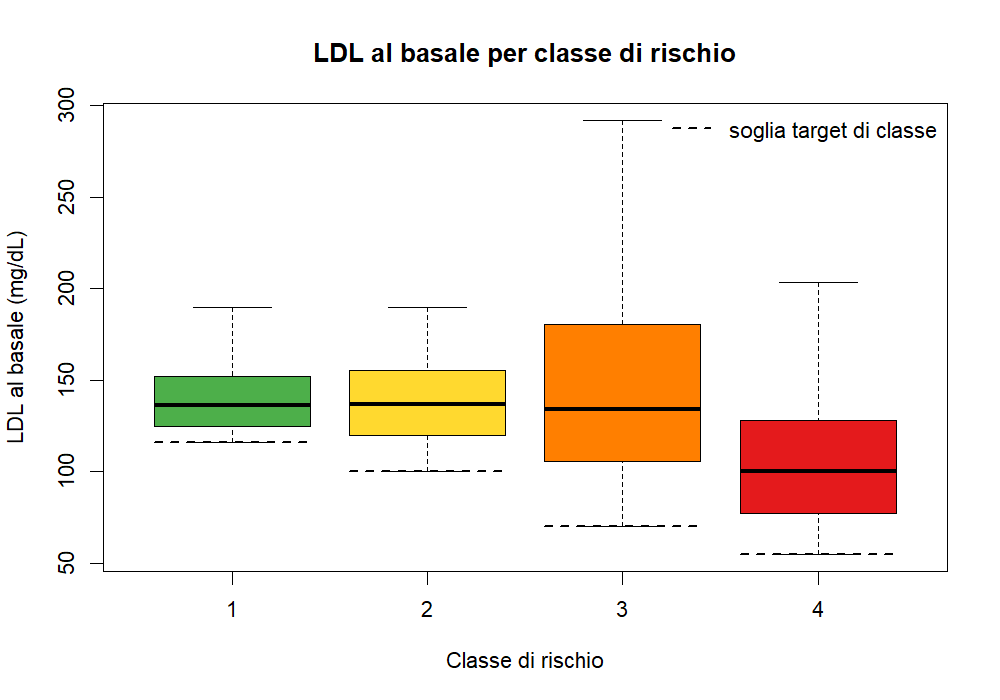
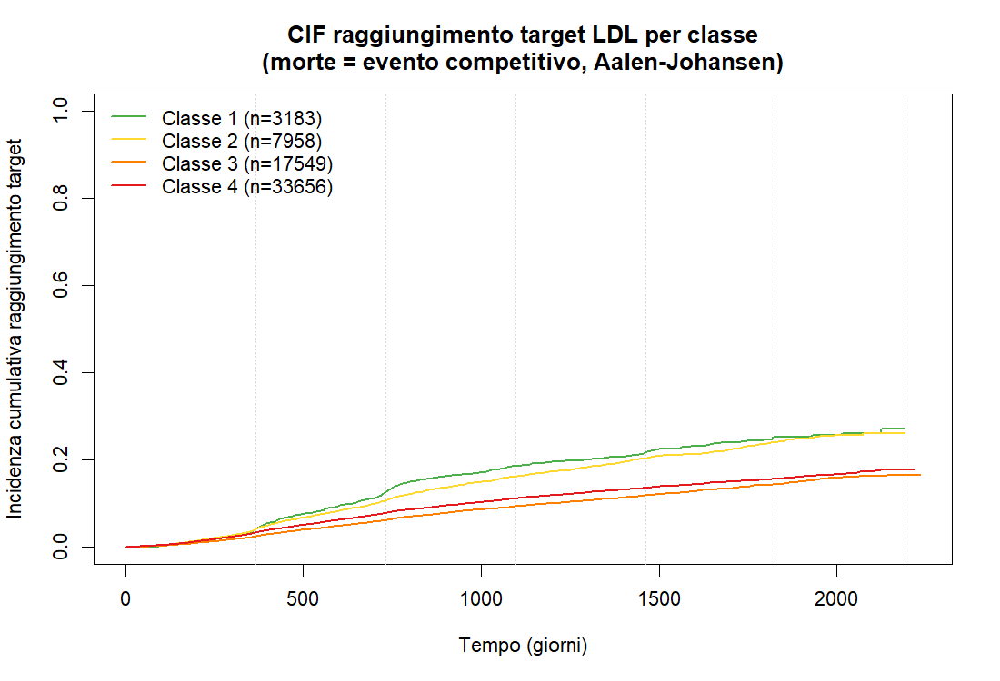
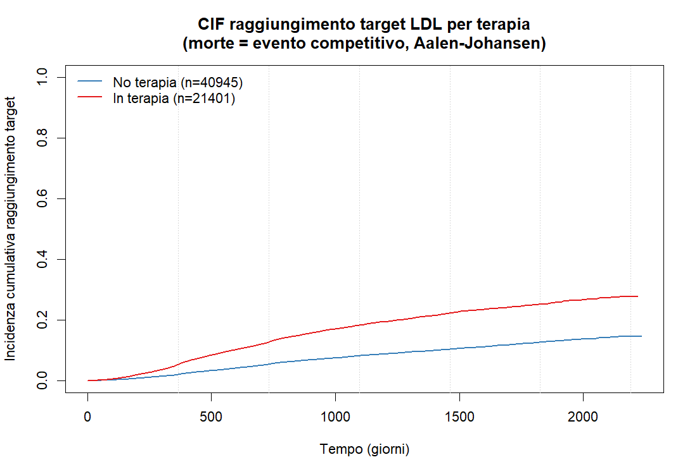

# Studio di raggiungimento del target LDL

Fonte dati: `longitudinal/data/LDLFUP_TARGET.csv` (62.346 pazienti, 1 riga per paziente).

## Descrittive

### Identificativo e baseline
| Colonna | Significato | Uso |
|---|---|---|
| `KEY_ANAGRAFE` | ID paziente | chiave |
| `data_indice` | data di arruolamento (T0) | origine del tempo |
| `ldl_indice` | LDL al basale (mediana 118,8; range 55–456) | covariata chiave + verifica baseline |
| `gender`, `age` | sesso, età (mediana 74) | covariate / stratificazione |

### Definizione del target (outcome)
| Colonna | Significato |
|---|---|
| `classe` | classe di rischio 1–4 |
| `soglia` | target LDL dipendente dalla classe: classe1→116, classe2→100, classe3→70, classe4→55 mg/dL |
| `reached` | 1 = target raggiunto durante il follow-up |

Distribuzione classe × soglia (confermata corretta):

| classe | soglia (mg/dL) | n |
|---|---|---|
| 1 | 116 | 3.183 |
| 2 | 100 | 7.958 |
| 3 | 70 | 17.549 |
| 4 | 55 | 33.656 |

### Tempo ed esito (rischi competitivi)
| Colonna | Significato |
|---|---|
| `status` | 0 = censurato · 1 = target raggiunto · 2 = morte |
| `tempo` | giorni di follow-up (mediana 947, max 2233) |
| `data_event` | data raggiungimento target (presente nel 100% dei status=1) |
| `data_decesso` / `data_fine` | morte (`31DEC9999`=vivo) / fine follow-up (censura amministrativa a 31DEC2025) |

Distribuzione `status`:

| status | descrizione | n |
|---|---|---|
| 0 | censurato | 43.925 |
| 1 | target raggiunto | 7.585 |
| 2 | morte (evento competitivo) | 10.836 |

### Terapia
| Colonna | Significato | n con flag = 1 |
|---|---|---|
| `terapia` | in terapia ipolipemizzante sì/no | 21.401 |
| `sta` | statina | 20.246 |
| `eze` | ezetimibe | 5.779 |
| `bem` | acido bempedoico | 144 |
| `inc` | inclisiran | 16 |
| `pcs` | PCSK9 inibitore | 114 |

### Multiterapia (combinazioni di farmaci al basale)

Numero di farmaci per paziente (tra i 5 flag):

| N. farmaci | Pazienti | % totale |
|---|---|---|
| 0 (nessuna terapia) | 40.945 | 65,7% |
| 1 | 16.597 | 26,6% |
| 2 | 4.710 | 7,6% |
| 3 | 94 | 0,2% |
| 4–5 | 0 | 0% |

- **Multiterapia (≥2 farmaci): 4.804 pazienti = 7,7% del totale, 22,4% dei 21.401 in terapia.**
- I flag sono coerenti: `terapia=1` ⟺ ≥1 farmaco; `terapia=0` ⟺ nessun farmaco (0 incongruenze).

Tutte le 17 combinazioni osservate (coda inclusa):

| Combinazione | Pazienti |
|---|---|
| sta | 15.524 |
| sta+eze | 4.631 |
| eze | 982 |
| sta+eze+bem | 62 |
| pcs | 57 |
| eze+bem | 44 |
| bem | 27 |
| eze+pcs | 23 |
| sta+eze+pcs | 23 |
| inc | 7 |
| eze+bem+pcs | 5 |
| eze+inc | 5 |
| bem+pcs | 4 |
| sta+eze+inc | 3 |
| sta+pcs | 2 |
| eze+bem+inc | 1 |
| sta+bem | 1 |

Nota: la multiterapia è quasi sempre statina-centrica (`sta+eze` domina). I farmaci innovativi
(`bem` 144, `pcs` 114, `inc` 16) compaiono quasi solo in combinazione e con numeri piccoli →
nei modelli avranno scarsa potenza come categorie singole; probabile raggruppamento (es.
"combinazione" o "include farmaco innovativo").

### Classi di rischio per fascia di età

### LDL al basale (`ldl_indice`) per classe di rischio

Script: `src/descrittiva_ldl_basale.R` · Report: `reports/descrittiva_ldl_basale.txt` ·
Figura: `outputs/ldl_basale_per_classe.png`.

| Classe (soglia) | n | Media (SD) | Mediana [Q1–Q3] | Min–Max |
|---|---|---|---|---|
| 1 (target 116) | 3.183 | 139,9 (18,0) | 136,0 [125,0–152,0] | 116–190 |
| 2 (target 100) | 7.958 | 138,5 (22,9) | 136,6 [120,0–155,4] | 100–190 |
| 3 (target 70) | 17.549 | 142,5 (46,3) | 134,0 [105,8–180,6] | 70–456 |
| 4 (target 55) | 33.656 | 105,8 (35,3) | 100,0 [77,4–128,0] | 55–434 |

LDL complessivo: media 122,1 · mediana 118,8 mg/dL. Kruskal-Wallis tra classi: χ²=12.373, p<10⁻¹⁰.

Note interpretative:
- Il **minimo di ogni classe coincide con la sua soglia** (classe 1=116, …, classe 4=55): la
  coorte include per ogni classe solo pazienti con LDL basale ≥ target, cioè *non ancora a target*
  all'arruolamento (criterio di ingresso dello studio di raggiungimento).
- La **classe 4 (rischio più alto) ha l'LDL basale più basso** (mediana 100): avendo target più
  stringente (55), bastano valori moderati per essere fuori target; la distribuzione dell'LDL
  basale è quindi guidata dalla soglia di ingresso, non dalla gravità clinica.
- Variabilità maggiore nelle classi a target basso (classe 3: SD 46, max 456); le classi 1–2 sono
  più compatte con tetto ~190.

## Disegno dello studio (proposto)

L'outcome `reached` ha un rischio competitivo evidente (10.836 morti prima del target),
quindi non Kaplan-Meier semplice ma:

1. **Incidenza cumulativa (Aalen-Johansen / CIF)** del raggiungimento target, con la morte
   come evento competitivo; curve complessive e per `classe`, `terapia`, `gender`, fasce di età.
2. **Modello di Fine-Gray** (subdistribution hazard) per i fattori associati al raggiungimento,
   aggiustando per età, sesso, classe, `ldl_indice`, terapia/tipo di farmaco.
3. **Cause-specific Cox** in parallelo, per separare effetto biologico e predittivo.
4. Descrittive di supporto: % raggiungimento e tempo mediano per classe.

Le soglie per classe sono confermate corrette.

## Protocollo

Analisi: **curve di incidenza cumulativa (CIF) del raggiungimento del target LDL, con la morte
come evento competitivo.**

### Definizione del modello time-to-event
- Tempo: `tempo` (giorni dall'arruolamento, `data_indice` = T0).
- Stato a 3 livelli da `status`:
  - `0` = censurato (fine follow-up / amministrativo a 31DEC2025)
  - `1` = **target raggiunto** (evento di interesse)
  - `2` = **morte** (evento competitivo)
- Oggetto: `Surv(tempo, factor(status, 0:2, labels = c("censor","target","morte")))`.

### Stimatore
- **Aalen-Johansen via `survival::survfit`** → CIF con IC 95% (è lo stimatore corretto sotto
  rischio competitivo; NON 1−Kaplan-Meier).
- **`cmprsk::cuminc`** in parallelo per il **test di Gray** sul confronto tra gruppi.

### Stratificazioni (concordate)
1. **`classe` di rischio (1–4)** — analisi principale (la soglia dipende dalla classe).
2. **`terapia` (0/1)** al basale.
- (Sesso, fasce di età e gruppi di farmaco: analisi secondarie eventuali.)

### Output
- **Figure** (`ldltarget/outputs/`): curve CIF del **solo raggiungimento target** (la CIF della
  morte non viene rappresentata in figura), una per stratificazione (classe; terapia).
- **Tabelle** (`ldltarget/reports/`): CIF stimata a tempi fissi (1–6 anni) con IC 95%
  per gruppo, tempo mediano al target dove stimabile, e **p del test di Gray**.

## Risultati CIF

Script: `src/cif_target.R` · Report dettagliato: `reports/cif_target.txt` ·
Figure: `outputs/cif_target_classe.png`, `outputs/cif_target_terapia.png`.

Coorte: 62.346 pazienti — target raggiunto 7.585, morte (competitivo) 10.836, censurati 43.925.
Stimatore Aalen-Johansen (morte = evento competitivo).

### CIF raggiungimento target per CLASSE di rischio (%)

| Classe (n) | 1 anno | 2 anni | 3 anni | 4 anni | 5 anni | 6 anni |
|---|---|---|---|---|---|---|
| 1 (n=3.183) | 4,0 | 12,5 | 18,4 | 21,6 | 25,1 | 27,1 |
| 2 (n=7.958) | 4,0 | 10,5 | 16,1 | 20,3 | 23,9 | 26,0 |
| 3 (n=17.549) | 2,3 | 6,1 | 9,3 | 11,8 | 14,3 | 16,4 |
| 4 (n=33.656) | 3,2 | 7,7 | 11,1 | 13,5 | 15,6 | 17,8 |

Test di Gray (differenza tra classi): **p < 0,0001**.

### CIF raggiungimento target per TERAPIA (%)

| Gruppo (n) | 1 anno | 2 anni | 3 anni | 4 anni | 5 anni | 6 anni |
|---|---|---|---|---|---|---|
| No terapia (n=40.945) | 2,0 | 5,3 | 8,2 | 10,3 | 12,6 | 14,5 |
| In terapia (n=21.401) | 5,3 | 12,7 | 18,2 | 22,2 | 25,1 | 27,7 |

Test di Gray (differenza per terapia): **p < 0,0001**.

Note: IC 95% per gruppo/tempo nel file `cif_target.txt`. Gli IC al 5°–6° anno sono più larghi
per il calo dei pazienti a rischio (follow-up: mediana 947 gg, max 2233 gg).

## Modello di Fine-Gray — cos'è

Script: `src/finegray_target.R` · Report: `reports/finegray_target.txt`.

Il modello di Fine-Gray è una regressione per dati time-to-event **in presenza di rischi
competitivi**. Nel nostro studio:
- **Evento di interesse**: raggiungere il target LDL.
- **Evento competitivo**: la morte — chi muore non potrà più raggiungere il target e non va
  trattato come una semplice censura (come se potesse ancora raggiungerlo).

**Problema che risolve.** Il Cox classico stima l'*hazard causa-specifico* trattando le morti
come censure: utile per il meccanismo biologico, ma distorce il rischio assoluto (la 1−Kaplan-
Meier sovrastima quanti raggiungono il target perché ignora che i morti escono definitivamente).

**Idea di Fine-Gray.** Invece dell'hazard istantaneo, modella direttamente la **funzione di
incidenza cumulativa (CIF)** — la stessa curva stimata con Aalen-Johansen. Lo fa tramite il
**subdistribution hazard**: i soggetti con evento competitivo (morte) **restano nel set a
rischio** (con peso decrescente) invece di uscire. Così i coefficienti descrivono come le
covariate spostano la probabilità cumulativa *effettiva* di raggiungere il target.

**Interpretazione (sHR = subdistribution Hazard Ratio):**
- **sHR > 1** → maggiore incidenza cumulativa di raggiungimento target;
- **sHR < 1** → minore incidenza cumulativa.
È l'analogo dell'HR di Cox, ma riferito alla CIF, quindi direttamente leggibile in termini di
"chi raggiunge di più/di meno il target nel tempo reale".

**Fine-Gray vs Cox causa-specifico** (entrambi nel protocollo):

| | Fine-Gray (sHR) | Cox causa-specifico (HR) |
|---|---|---|
| Modella | la CIF (rischio assoluto) | l'hazard istantaneo |
| Tratta la morte | resta a rischio (pesata) | come censura |
| Risponde a | "chi raggiunge di più il target?" | "qual è il meccanismo/rate istantaneo?" |
| Uso tipico | predizione, impatto clinico | eziologia |

**Specifica del modello stimato:** covariate al basale = età (per 10 anni), sesso, classe di
rischio, LDL indice (per 10 mg/dL), terapia. Referenze: classe 4, sesso F, terapia No.
Risultati (sHR, IC 95%, p) in `reports/finegray_target.txt`.

### Risultati del modello (sHR)

N = 62.346 · target 7.585 · morte 10.836 · censurati 43.925. Referenze: classe 4, sesso F, terapia No.

| Variabile | sHR | IC 95% | p | Lettura |
|---|---|---|---|---|
| Età (+10 anni) | 0,861 | 0,845–0,878 | <10⁻⁵² | −14% per decade |
| Sesso M (vs F) | 1,269 | 1,212–1,330 | <10⁻²³ | uomini +27% |
| Classe 1 (vs 4) | 2,735 | 2,410–3,102 | <10⁻⁵⁴ | molto più probabile |
| Classe 2 (vs 4) | 2,757 | 2,540–2,993 | <10⁻¹²⁸ | molto più probabile |
| Classe 3 (vs 4) | 1,462 | 1,374–1,555 | <10⁻³² | più probabile |
| LDL indice (+10 mg/dL) | 0,855 | 0,847–0,864 | <10⁻²⁰² | LDL basale più alto → meno raggiungimento |
| Terapia Sì (vs No) | 1,957 | 1,856–2,064 | <10⁻¹³⁴ | in terapia ~2× |

Sintesi: il raggiungimento del target è guidato soprattutto dall'LDL basale (più si è lontani
dalla soglia, meno la si raggiunge) e dalla terapia (~2×); le classi a target meno stringente
(1–2) raggiungono di più della classe 4; età avanzata e sesso femminile si associano a minore
raggiungimento.

### CIF vs sHR — come interpretarli

Sono misure diverse e complementari:

- **CIF (incidenza cumulativa)** = probabilità assoluta (0–100%), dipendente dal tempo. Es. "a 6
  anni il 20% ha raggiunto il target". Risponde a *"quanti raggiungono il target e quando?"*.
- **sHR (subdistribution Hazard Ratio)** = rapporto relativo tra gruppi, valore unico, aggiustato
  per le altre covariate. NON è una probabilità. Risponde a *"quante volte di più/di meno
  rispetto al gruppo di riferimento?"*. sHR>1 = CIF più alta; sHR<1 = CIF più bassa.

Esempio di collegamento (terapia): sHR ≈ 1,96 ≈ rapporto tra le CIF a 6 anni (27,7% in terapia
vs 14,5% senza ≈ 1,9). La CIF dà i due numeri assoluti, lo sHR li riassume in "circa il doppio".

| | CIF | sHR |
|---|---|---|
| Cos'è | probabilità (0–100%) | rapporto tra gruppi |
| Dipende dal tempo? | sì (1…6 anni) | no, valore unico |
| Aggiustato? | no (curva grezza) | sì (al netto delle altre covariate) |
| Risponde a | "quanti raggiungono il target?" | "quante volte di più del riferimento?" |

Avvertenze: (1) lo sHR è aggiustato, la CIF grezza no → il match non è sempre perfetto (es.
classe 1 vs 4: sHR 2,7 ma CIF grezze 6 anni 27,1% vs 17,8% ≈ 1,5, perché lo sHR isola l'effetto
della classe tenendo costanti LDL, età, sesso, terapia); (2) lo sHR si assume costante nel tempo,
la CIF mostra l'andamento anno per anno.

## Modello di Cox causa-specifico

Script: `src/coxcs_target.R` · Report: `reports/coxcs_target.txt`.

### Cos'è

Modello di Cox sull'**hazard causa-specifico**: il *tasso istantaneo* con cui si raggiunge il
target **tra i pazienti ancora a rischio e ancora in vita** in ogni istante. La differenza chiave
dal Fine-Gray è come tratta la morte:
- **Cox causa-specifico**: chi muore esce dal set a rischio → la morte è trattata come **censura**.
- **Fine-Gray**: chi muore **resta** a rischio (pesato), perché non potrà mai raggiungere il target.

Risponde a una domanda **biologica/meccanicistica**: tra chi è ancora vivo e non a target, quanto
velocemente lo raggiunge in funzione delle covariate (effetto sul *processo*, depurato dalla morte
competitiva).

### Risultati (HR causa-specifico)

N = 62.346 · eventi target 7.585. Referenze: classe 4, sesso F, terapia No.

| Variabile | HR | IC 95% | p |
|---|---|---|---|
| Età (+10 anni) | 0,930 | 0,910–0,951 | <10⁻¹⁰ |
| Sesso M (vs F) | 1,325 | 1,264–1,389 | <10⁻³⁰ |
| Classe 1 (vs 4) | 2,926 | 2,579–3,321 | <10⁻⁶¹ |
| Classe 2 (vs 4) | 2,577 | 2,378–2,792 | <10⁻¹¹⁷ |
| Classe 3 (vs 4) | 1,342 | 1,261–1,427 | <10⁻¹⁹ |
| LDL indice (+10 mg/dL) | 0,843 | 0,836–0,851 | <10⁻²⁸⁷ |
| Terapia Sì (vs No) | 1,724 | 1,631–1,823 | <10⁻⁸¹ |

### Cosa dice di diverso da CIF e sHR

| | CIF | sHR (Fine-Gray) | HR (Cox causa-specifico) |
|---|---|---|---|
| Cos'è | probabilità assoluta nel tempo | rapporto sul rischio assoluto (CIF) | rapporto sul tasso istantaneo |
| La morte | la "consuma" (riduce il target) | il soggetto resta a rischio | trattata come censura |
| Domanda | "quanti raggiungono il target?" | "chi raggiunge di più, in assoluto?" | "qual è il meccanismo/velocità?" |
| Uso | impatto clinico, predizione | predizione/equità | eziologia, effetto biologico |

**Confronto diretto HR vs sHR:**

| Variabile | HR (causa-spec.) | sHR (Fine-Gray) |
|---|---|---|
| Età (+10 anni) | 0,930 | 0,861 |
| Sesso M | 1,325 | 1,269 |
| Classe 1 vs 4 | 2,926 | 2,735 |
| Classe 2 vs 4 | 2,577 | 2,757 |
| Classe 3 vs 4 | 1,342 | 1,462 |
| LDL (+10 mg/dL) | 0,843 | 0,855 |
| Terapia Sì | 1,724 | 1,957 |

Lettura delle differenze (esempio età): HR 0,930 = tra i vivi, −7% sul tasso istantaneo per
decade; sHR 0,861 = −14% sull'incidenza cumulativa. L'età agisce **due volte contro** il
raggiungimento — rallenta il processo *e* aumenta la mortalità competitiva — e il Fine-Gray
cattura entrambi gli effetti, il causa-specifico solo il primo (→ sHR più estremo). Idem per la
terapia (sHR 1,96 > HR 1,72): chi è in terapia raggiunge più in fretta e muore meno.

**Regola pratica:** se per una covariata HR e sHR vanno nella stessa direzione e lo sHR è più
estremo, l'evento competitivo (morte) **rinforza** l'effetto sul rischio assoluto. In direzioni
opposte, effetto sul processo e sulla mortalità si compensano.

**Sintesi d'uso:** Cox causa-specifico → *meccanismo* (cosa accelera il raggiungimento tra i vivi);
Fine-Gray/sHR → *impatto clinico assoluto* (chi arriva a target nella vita reale); CIF → *numeri
assoluti* nel tempo. Qui i tre approcci concordano qualitativamente, a conferma della robustezza.
Il report `coxcs_target.txt` include anche la verifica dell'assunzione di proporzionalità (`cox.zph`).
